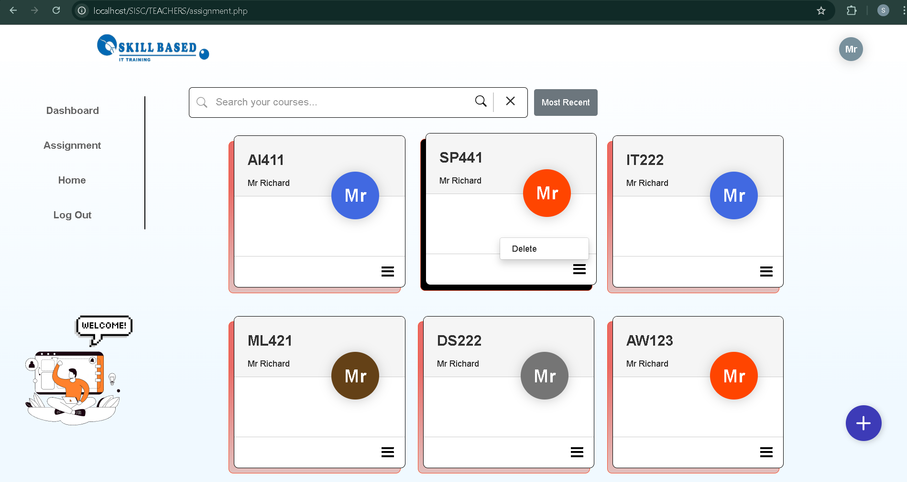
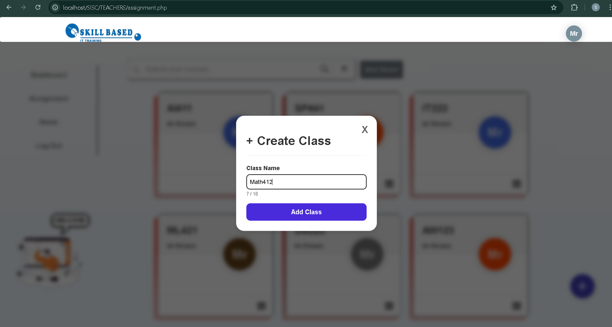
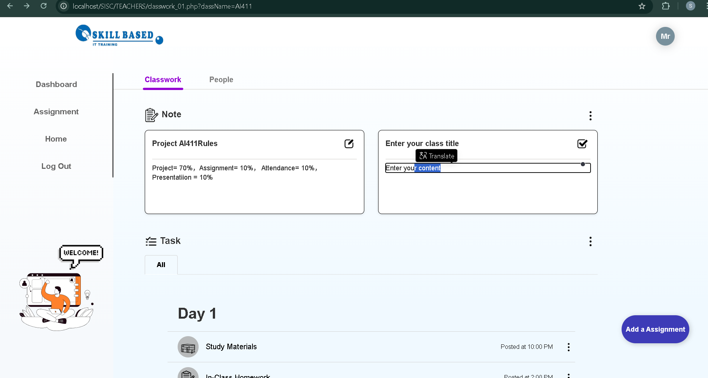
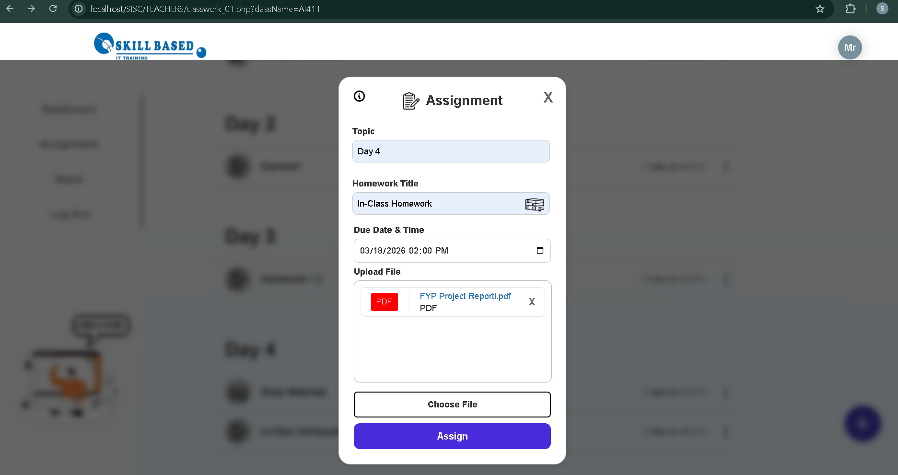
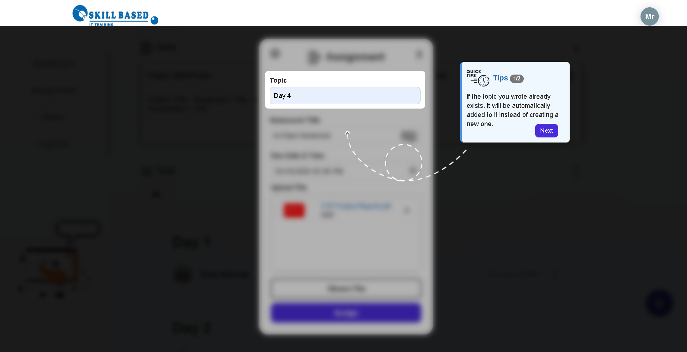
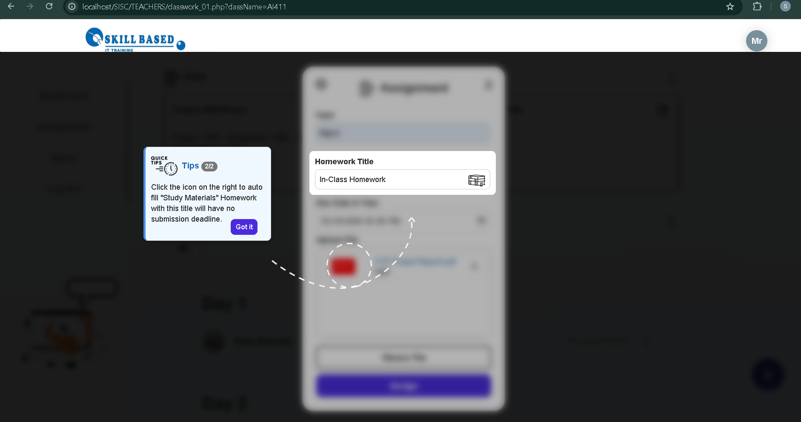
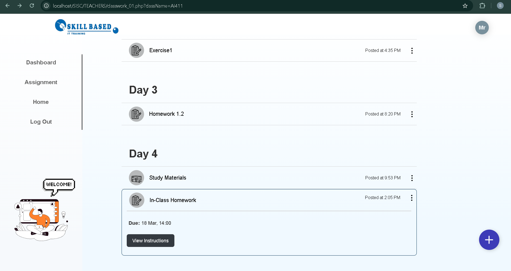

# 🎓 Assignment Management System (AMS)

A robust, full-stack Assignment Management System designed to streamline academic workflows. This platform facilitates seamless interaction between Admins, Teachers, and Students, focusing on submission efficiency and real-time progress tracking.
  

## 💡 Key Highlights

*  **Dynamic Countdown Timer** Implemented a real-time countdown system using **JavaScript** to provide students with visual cues for submission deadlines, significantly improving time management.

*  **Role-Based Access Control (RBAC)** Customized permissions for **Admins, Teachers, and Students** to ensure data security and functional clarity.

*  **Comprehensive Reporting** Automated tracking for late submissions, providing teachers with instant analytical insights and student progress reports.
 

## Core Features

* **Assignment Lifecycle:** Full support for assignment creation, multi-format file uploads, and grading.
* **Secure Authentication:** Encrypted login system to protect academic staff and student data.
* **Responsive UI:** A clean, intuitive interface designed for both desktop and mobile browsers.
* **Feedback Loop:** Integrated system for teachers to provide direct feedback and grades on student submissions.
 

## 🛠️ Tech Stack

| Layer | Technologies |
| :--- | :--- |
| **Frontend** | `HTML5`, `CSS3/SCSS`, `JavaScript (ES6)` |
| **Backend** | `PHP` (Business Logic & Routing) |
| **Database** | `MySQL` (Relational Schema Design) |
 

## 📝 Project Deliverables

- [x] **Fully Functional Web Application**
- [x] **Database Schema & Documentation**
- [x] **Technical Final Report & User Manual**
- [x] **Presentation Slides & Demo**
 

## Project Presentation Design (Teacher Interface)

  
   
  <i>(Teacher Interface: Dashboard Home)</i>

  

  
   
  <i>(Teacher Interface: Class Management / Add New Class)</i>

  

  
   
  <i>(Teacher Interface: Assignment Overview)</i>

  

  
   
  <i>(Teacher Interface: Create New Assignment)</i>

  

  
   
  <i>(Teacher Interface: Assignment Guidelines)</i>

  

  
   
  <i>(Teacher Interface: Assignment Guidelines)</i>

  

  
   
  <i>(Teacher Interface: Student Submissions View)</i>

  

  
   
  <i>(Teacher Interface: File Update & Management)</i>

  

  
   
  <i>(Teacher Interface: View Assignment)</i>

  

  
   
  <i>(Teacher Interface: Update File Function)</i>

  

  
   
  <i>(Teacher Interface: Update File Function)</i>

  

  
   
  <i>(Teacher Interface: Update File & View)</i>

  

  
   
  <i>(Teacher Interface: Class Members & Student List)</i>

  

## 👨‍🎓 Project Presentation Design (Student Interface)

  
   
  <i>(Student Interface: Dashboard Home)</i>

  

  
   
  <i>(Student Interface: Class Management / Join New Class)</i>

  

  
   
  <i>(Student Interface: Class Search & Enrollment)</i>

  

  
   
  <i>(Student Interface: Assignment Overview)</i>

  

  
   
  <i>(Student Interface: Pending Assignment View)</i>

  

  
   
  <i>(Student Interface: Completed Submission View)</i>

  

  
   
  <i>(Student Interface: Class Members & Student List)</i>

  

